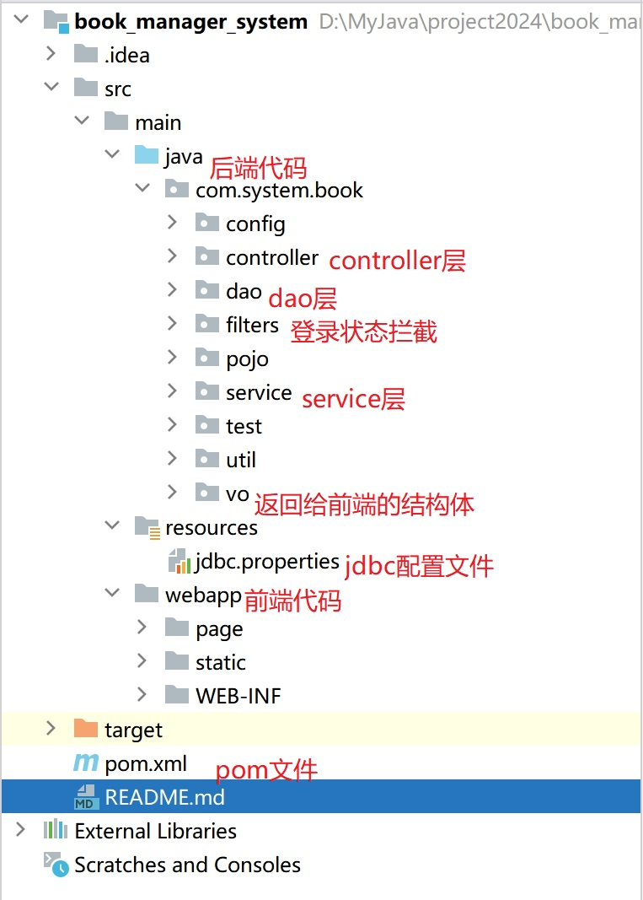
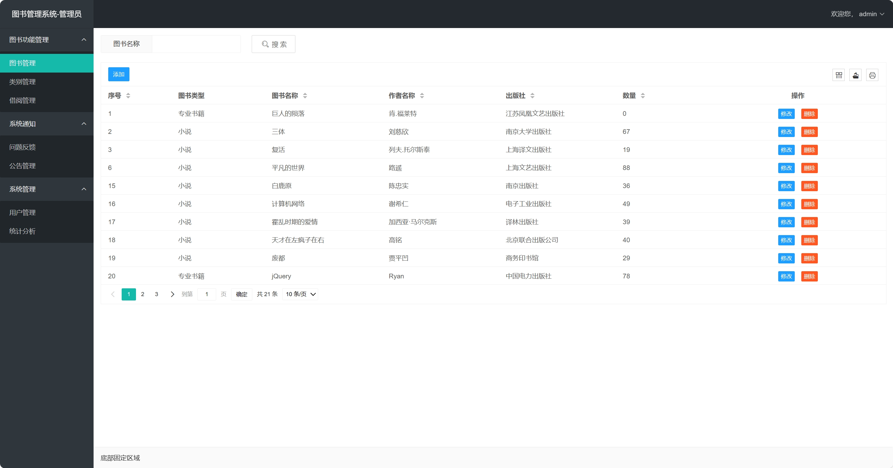
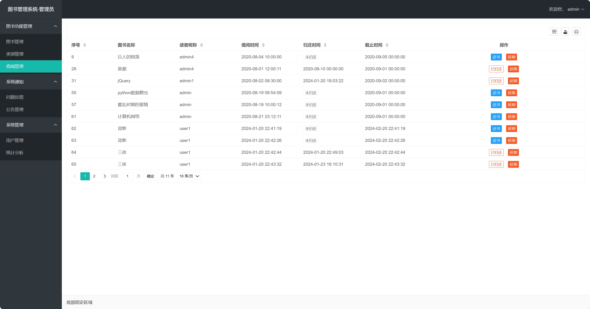
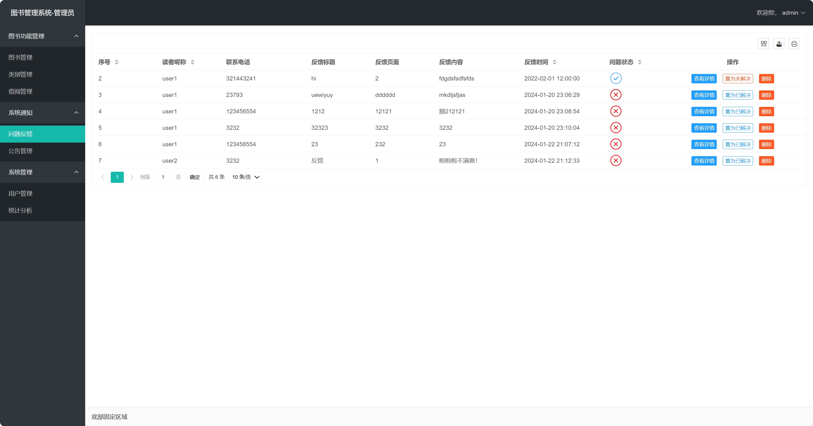
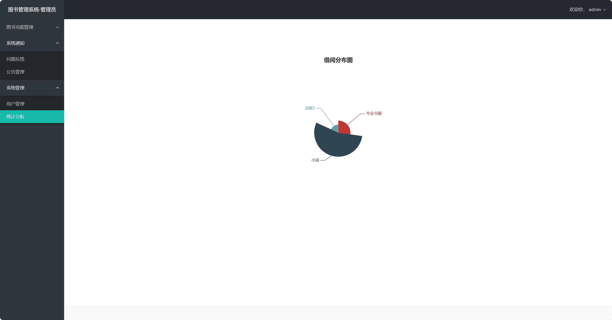
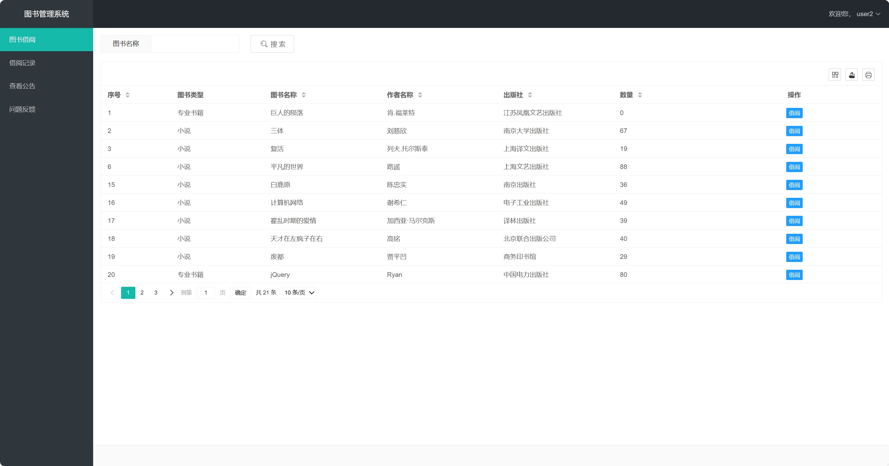

## 1. 项目概述
本系统为图书管理系统，主要支持图书的借阅和其他功能，包含管理员和读者两个端。

### 1.1 技术框架
**前端**：LayUI + Thymleaf + html + css + ajax

**后端**：SpringMVC + MySQL + tomcat + JDBC

**其他**：使用maven依赖管理工具，谷歌验证码kaptcha
> 使用LayUI官方框架，地址：https://layui.dev/docs/2/index.html

### 1.2 功能实现
**管理员端**

* 图书管理：（增删改查）分页查询，模糊查找，编辑时下拉框回显
* 类别管理：（增删改）
* 借阅管理：分页查询，还书，延期，以及一些前端显示
* 问题反馈：分页查询，详情查看，问题状态修改，删除，以及一些前端显示
* 公告管理：（增删查）
* 统计分析：类别的借书数量饼图
* 用户管理：（增删改查）修改用户的手机号和借阅数

**用户端**
* 图书借阅：分页查询，模糊查找，借阅以及相应记录的生成
* 借阅记录：分页查询，还书，以及一些前端显示
* 查看公告：分页查询，模糊查找，详情查看
* 问题反馈：分页查询，新增，以及一些前端显示

### 1.3 环境
**开发工具**

* IDEA社区版（社区版没有js代码高亮，配置tomcat需要安装smart tomcat插件）
* MySQL可视化控制台，我使用的是DBeaver，其他navicat等均可

**后端环境**

* JDK1.8
* maven3
* tomcat8.5
* MySQL8
> 上述环境请提前安装好并保证可用

### 1.4 项目结构

## 2. 部署建议
### 2.1 数据库表准备
本系统涉及6张数据表，相关的建表语句在

src/main/resources/dump-book-manager-202401231755.sql

新建数据库 book-manager 并执行上述sql，即可获得数据表及一些测试数据。
### 2.2 修改数据库连接

修改项目中jdbc.properties的mysql账号密码

### 2.3 运行
确保idea的tomcat已经配置好，然后就可以运行了！

启动完成后，浏览器中输入：http://localhost:8080/book_manager_system/page/user/login.html

## 3. 运行展示

